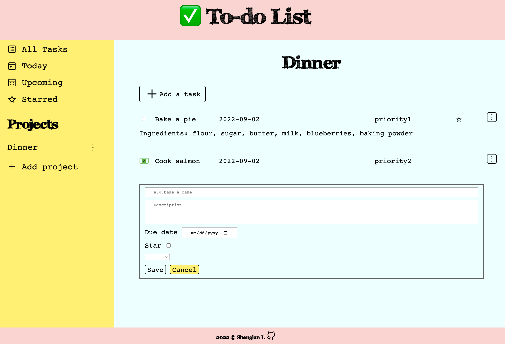

# To-do List
## Demo
Click [here](https://wukongo-o.github.io/to-do/) to check out the to-do list! 🤓 📆 ✅ 🚩

## Description
I designed and built the to-do list web app by following the OOP principals. It also uses webpack to bundle JS modules and manage assets.

## Features
- Dynamically render the to-do items and projects
- Each item can be edited or deleted
- Cross off finished item
- To-do items stored in localStorage
- Use JavaScript alone to generate the entire website
- Use webpack to compile JavaScript modules

## Built with
Pure JavaScript, CSS, HTML, Webpack